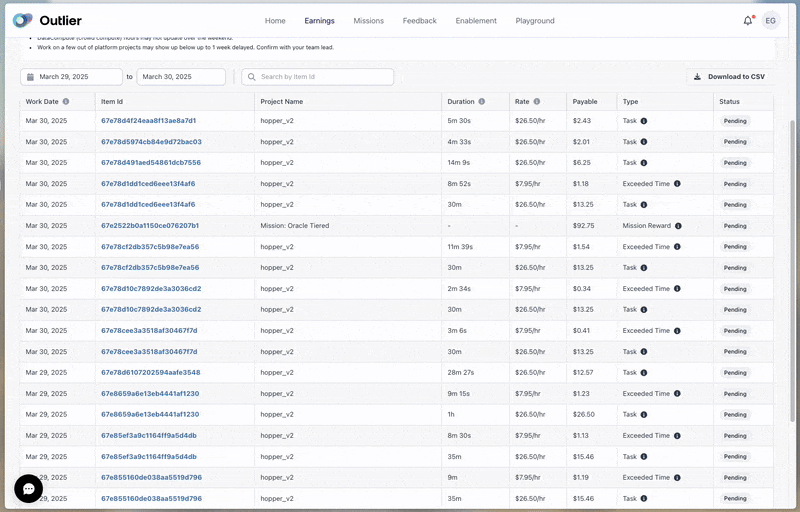

# Go Task Viewer

A web application for analyzing task data and generating reports. Built with Go and designed to be deployed on Railway.

## Demo



## Features

- Upload task data via text input or CSV file
- Analyze total hours worked and financial metrics
- View detailed breakdowns of individual tasks
- Calculate average hourly rates
- Distinguish between regular tasks and exceeded time

## Input Formats

Two input methods are supported:

### Text Format

Paste formatted task data with each entry having 8 lines in this format:

```
Date: Mar 30, 2025
ID: 67e78d4f24eaa8f13ae8a7d1
Category: hopper_v2
Duration: 5m 30s
Rate: $26.50/hr
Value: $2.43
Type: Task
Status: pending
```

### CSV Format

Upload a CSV file with the following headers:

```
workDate,itemID,duration,rateApplied,payout,payType,projectName,status
```

Example row:
```
"Mar 30, 2025","67e78d4f24eaa8f13ae8a7d1","5m 30s","$26.50/hr","$2.43","prepay","hopper_v2","pending"
```

## Local Development

```bash
# Run the application locally
go run main.go

# Build the application
go build -o app
```

## Deployment

This application is configured for easy deployment on Railway.app.

[](https://railway.app/template/BMuR4a?referralCode=alphasec)
